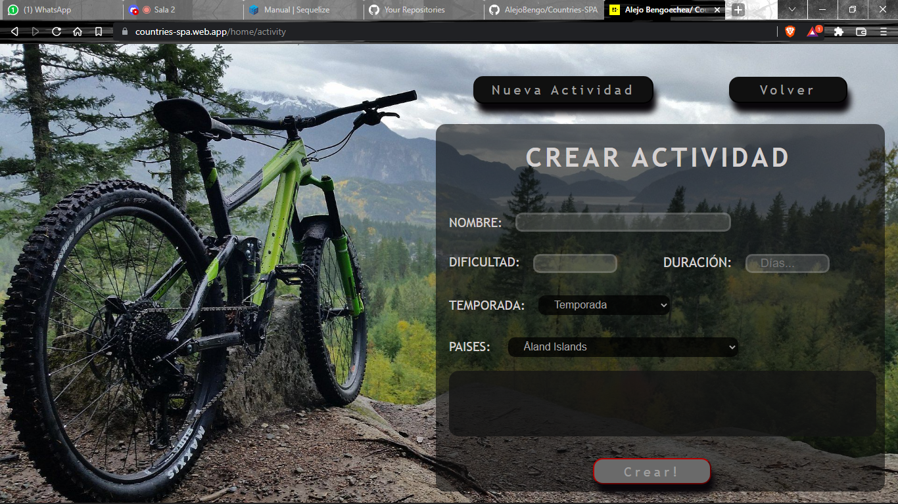
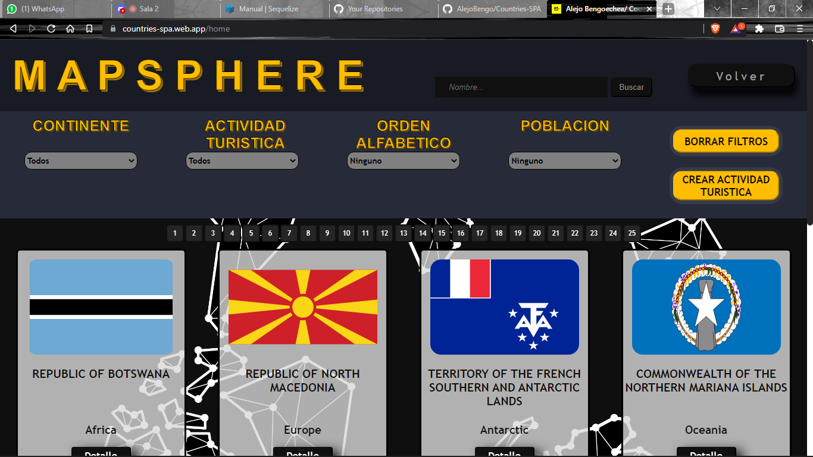

    

# Individual Project - Henry Countries

  

Countries SPA is a single page application developed by Alejo Bengoechea, where you will find every country in the world. You will have access to each country information (area, population, flag, etc.). This platform consumes data from a rest API and an own Database. You can order the countries alphabetically and by population. Also you can filter them by tourist activities and continent. This app also allow users to create new tourist activities .

## Proyect Objectives

-  Build an App using React, Redux, Node and Sequelize.
-  Affirm and connect the concepts learned through the course.
-  Learn better programming practices.
-  Learn and practice Git's workflow
-  Use and practice testing

## Technologies Stack:

Front-End:
- React
- Redux
- HTML
- CSS

Back-End:

-  Express
-  Sequelize
-  PostgreSQL

## Project Screens:

 
 

 
 

